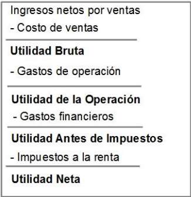

# sesion-03

- balance
- EER
- flujo de caja

son los 3 3 estados financieros que debiera llevar una empresa.

## Balance

activos: lo que tengo
pasivos: lo que debo, y a quién se lo debo
patrimonio: Recursos de los propietarios y ganancias acumuladas no retiradas

activos = patrimonio + pasivos

los activos se dividen según liquidez:

- corrientes: efectivo
- no corrientes: propiedades, planta, equipo

corriente = líquido

no corriente = fijo

pasivos: se clasifican en menos exigible a más exigible.

- corrientes: cuentas por pagar, préstamos a corto plazo.
- no corrientes: hipoteca, plata que le deben a los dueños.

patrimonio: última prioridad

## pre EERR

de arriba pa abajo, va de lo más variable a lo menos variable.

**margen bruto = utilidad bruta / ingreso por venta**

## análisis

### EERR

crecimiento  = %
margen = $N°
utilidad = %
ROE = %

### pre ratios de liquidez

días de caja = cantidad de días

### pre ratios operativos

días de cobro = días que mis clientes se demoran en pagarme, es el promedio entre los días de cobro de todos los clientes
días de existencias = días de materia prima para vender(válido solo para empresas que venden productos físicos)
días de pago a proveedores = la cantidad de días que llevo sin pagarle a mis proveedores

es importante tener un buen balance entre días de cobro y días de pago a proveedores.

### endeudamiento

apalancamiento financiero = pasivo/patrimonio. SI da más que 1, la empresa es del banco. SI es menos de uno, pertenece a los dueños. Es un ratio entre la deuda q debo a proveedores, sobre el patrimonio.

## costos y gastos

costo: asociado a la venta(cambia según ventas)
gastos: no relacionados con la venta(no cambia según venta)

## ratios

ratios son tipos de indicadores

### ratios de liquidez

es indicado por los Días de caja.
días_de_caja = **caja / gastos_diarios**

### ratios operativos

es indicado por

- días de cobro: **cuentas_por_cobrar * 360 / ventas**

- días de existencias: **existencias * 360 / costo_de_venta**

- cuentas_por_pagar * 360 / compras

### levarage o apalancamiento

leverage = **pasivo / patrimonio_neto**

